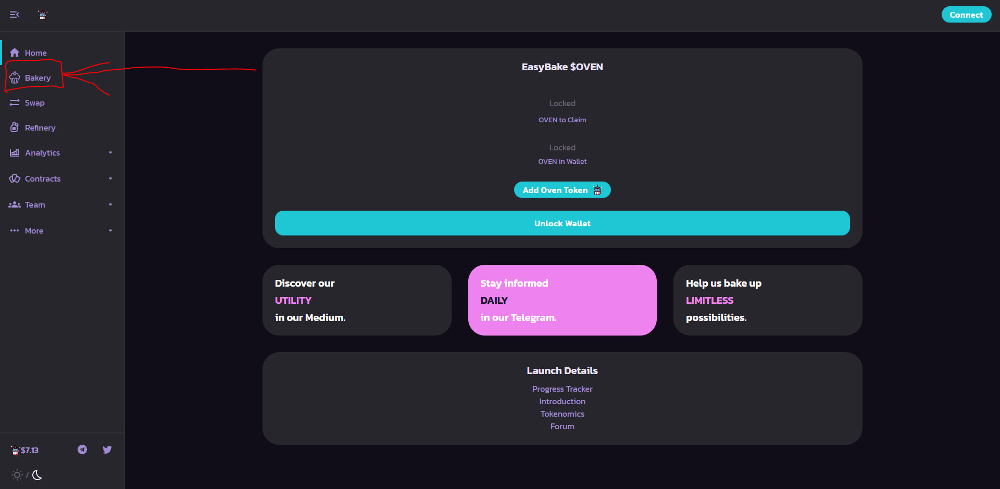

# How to use the Bakery

## Navigating to the Bakery UI

**First, you need to locate the Bakery tab on the far left of your screen \(Highlighted in red\).**

**Then, you'll be greeted by the current DOUGH Liquidity Pools available at the the time in a row format.**

**To change the rows into cards, click on the second icon \(the grid\) to the far left of the 'Baking Only' toggle button. Note: This will provide less details than the row format \(i.e. Liquidity\).**

## **Using the Bakery**

**Now that we've navigated to the Bakery's UI, lets deposit some of our USDC-ETH DOUGH tokens to start earning OVEN!   
First, we want to unlock our Ethereum wallet. In my case, I'm using MetaMask.**  

**Now that we're logged in, shown in the top right with the beginning & end characters of our wallet address, we are able to interact with the Bakery's ovens. Make sure you have DOUGH LP tokens in your wallet, if you don't have any head over to** [**http://easybake.finance/\#/add/0x4DBCdF9B62e891a7cec5A2568C3F4FAF9E8Abe2b/ETH**](http://easybake.finance/#/add/0x4DBCdF9B62e891a7cec5A2568C3F4FAF9E8Abe2b/ETH) **\(this is the DOUGH token we're going to provide\), then naviagate your way back here.** 

